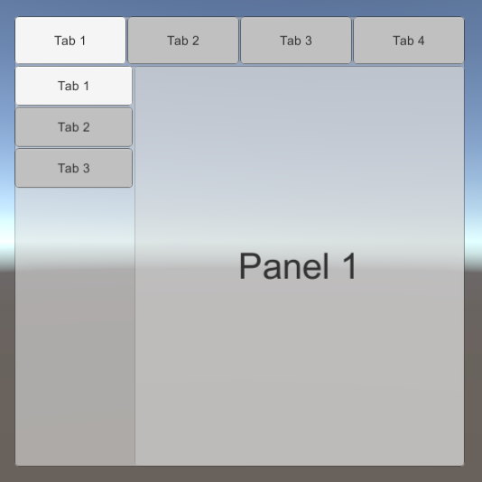
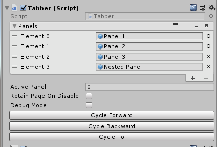
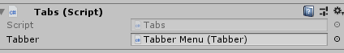

# Tabber for Unity
### requires [Reorderable-List](https://github.com/cfoulston/Unity-Reorderable-List) which is included.

With Tabber, creating a menu with tabs in Unity is pretty easy. In the example, I have the following UI element structure:

```
Canvas
└── Tabber Menu (Panel)
|	└── Tabs (Tabs)
|	|	└── Btn Tab 1
|	|	└── Btn Tab 2
|	|	└── Btn Tab 3
|	|	└── Btn Tab 4
|	└── Panels
|	|	└── Panel 1
|	|	└── Panel 2
|	|	└── Panel 3
|	|	└── Nested Panel
|	|	└── Tabs (Tabs)
|	|	|	└── Btn Tab 1
|	|	|	└── Btn Tab 2
|	|	|	└── Btn Tab 3
|	|	└── Panels
|	|	|	└── Panel 1
|	|	|	└── Panel 2
|	|	|	└── Panel 3
```

With this in mind, we will follow the below steps:
1. Attach `Tabber` component to `Tabber Menu`
2. Attach `Tabs` Component to `Tabber Menu`->`Tabs` - Component will update with the tab objects automatically at runtime
3. Assign `Tabber Menu` to `Tabber Menu`->`Tabs` `Tabber` property
4. Add each panel under `Tabber Menu`->`Panels` to the `Panels` property on `Tabber Menu`
5. Repeat these steps for `Nested Panel` and the corresponding `Tabs` object.

After these steps, you should be able to play and use the tab buttons to change which panel is being displayed. If you want the menu to remember which tab was used last when deactivating/reactivating the menu, turn on `Retain Page On Disable` on the `Tabber` component.





You can use the `Cycle Forward`, `Cycle Backward`, and `Cycle To` buttons to show the necessary panels in the editor. When using `Cycle To`, put the desired index in the `Active Panel` property before clicking, and you will cycle to that panel.